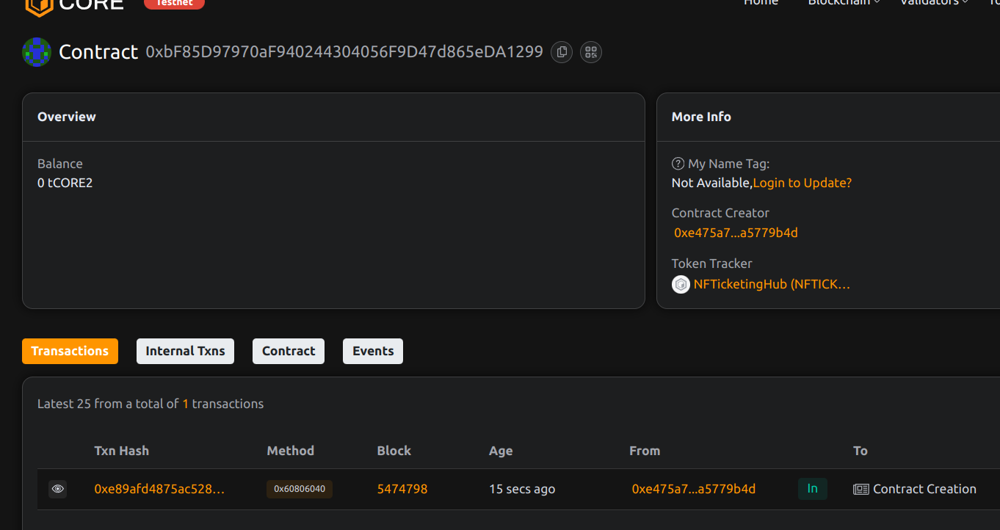

# NFTicketingHub: Blockchain-Based Event Ticketing Platform

## Project Description
NFTicketingHub is a decentralized platform that revolutionizes event ticketing by leveraging NFT technology. It provides a transparent, secure, and fraud-proof solution for event organizers and attendees, eliminating counterfeit tickets and secondary market scams.

## Project Vision
To create a trustless ticketing ecosystem where:
- Event organizers have full control over their events
- Tickets are verifiably scarce and authentic
- Secondary market transactions can be programmatically controlled
- All stakeholders benefit from blockchain transparency

## Key Features
- NFT-based digital tickets with unique identifiers
- Event creation and management dashboard
- Fixed price ticketing system
- Real-time ticket verification
- Secure payment processing
- Anti-scalping mechanisms

## Future Scope
- Implement royalty system for secondary sales
- Add tiered ticket pricing (VIP, General, etc.)
- Integrate with physical ticket verification systems
- Develop DAO governance for platform upgrades
- Create mobile app for ticket management

## Contract Details
0xbF85D97970aF940244304056F9D47d865eDA1299
